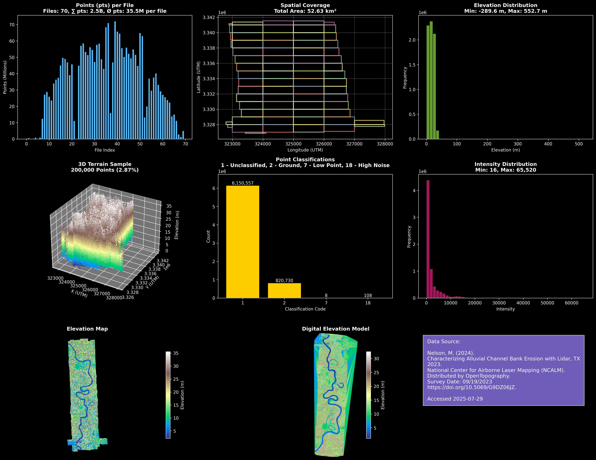

# Mapping Automation Agent

A Python-based LiDAR data processing tool for automated terrain mapping and analysis. This project processes United States Geological Survey (USGS) LiDAR data to generate digital elevation models (DEMs), terrain visualizations, and AI training datasets for drone mapping applications.

## Features

- Process LiDAR .laz files from USGS/OpenTopography
- Generate digital elevation models (DEM) as GeoTIFF files
- Create comprehensive terrain analysis visualizations
- Export processed data for AI/ML training
- Support for large-scale point cloud processing
- Automated spatial coverage analysis

## Project Structure

```
├── download_open_topography.py  # Download LiDAR data from OpenTopography
├── lidar_processor.py           # Main processing and analysis script
├── view_dem_3d.py               # 3D DEM visualization tool
├── requirements.txt             # Python dependencies
├── LICENSE                      # MIT License
├── README.md                    # This file
├── TX23_Nelson/                 # Raw LiDAR data directory
├── output_files/                # Generated outputs
│   ├── TX23_Nelson_lidar_analysis.png
│   ├── TX23_Nelson_processed_data.npy
│   └── TX23_Nelson_terrain_map.tif
```

## Installation

1. Clone the repository:
```bash
git clone https://github.com/yauheniya-ai/mapping-agent.git
cd mapping-agent
```

2. Install dependencies:
```bash
pip install -r requirements.txt
```

## Usage

### Processing Local LiDAR Data

Place your `.laz` files in the data directory (e.g., `TX23_Nelson/`) and run:

```bash
python lidar_processor.py
```

This will:
- Load and analyze all `.laz` files in the data directory
- Generate a comprehensive analysis visualization
- Create a DEM as GeoTIFF
- Export processed data for AI training

### Downloading Data from OpenTopography

Use the download script to fetch LiDAR data:

```bash
python download_open_topography.py
```

### 3D DEM Visualization

View generated DEMs in 3D:

```bash
python view_dem_3d.py
```

## Output Files

- **Analysis Visualization**: Comprehensive multi-panel analysis chart
- **DEM GeoTIFF**: Georeferenced digital elevation model
- **Training Data**: Processed point cloud data in NumPy format
- **Metadata**: Spatial statistics and terrain characteristics

## Results Preview

<div align="center">
  
  <p><em>Comprehensive LiDAR terrain analysis</em></p>
</div>

## Dependencies

- `laspy` - LiDAR data reading
- `rasterio` - Geospatial raster processing
- `matplotlib` - Visualization and plotting
- `numpy` - Numerical computing
- `pandas` - Data analysis
- `scipy` - Scientific computing
- `pyproj` - Coordinate system transformations
- `tqdm` - Progress bars

## Data Sources

This project is designed to work with USGS LiDAR data from OpenTopography. Example dataset used:

> Nelson, M. (2024). Characterizing Alluvial Channel Bank Erosion with Lidar, TX 2023. National Center for Airborne Laser Mapping (NCALM). Distributed by OpenTopography. https://doi.org/10.5069/G9DZ06JZ

## License

MIT License - see LICENSE file for details.

## Contributing

Contributions are welcome! Please feel free to submit pull requests or open issues for bugs and feature requests.